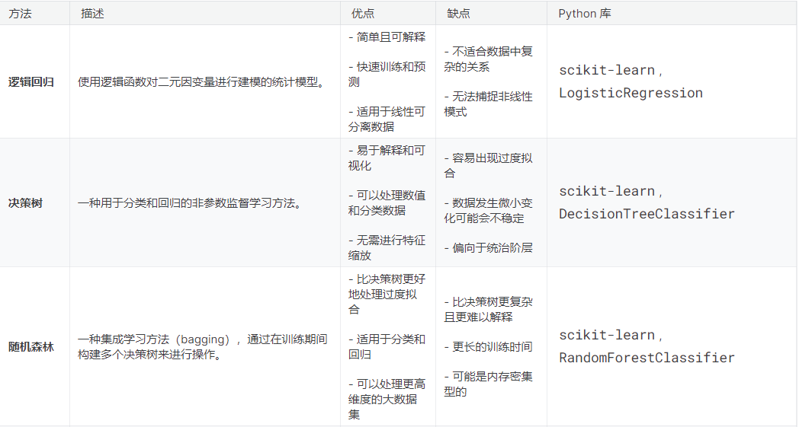

|      | col2                                                                                                     | col3 |
| ---- | -------------------------------------------------------------------------------------------------------- | ---- |
| Name | [Multi-Class Prediction of Cirrhosis Outcomes](https://www.kaggle.com/competitions/playground-series-s3e26) |      |
| Tags | Time Series Analysis Multi-Class                                                                         |      |
| Time |                                                                                                          |      |

# Multi-Class Prediction of Cirrhosis Outcomes

## **1.投票最高的笔记本**

### 1.1 [S3E26 | XGBClassifer](https://www.kaggle.com/code/markuslill/s3e26-xgbclassifer)

* 递归特征消除（RFE）算法可能很有趣，例如使用 sklearn.feature_selection.RFE [sklearn学习——递归特征消除法（RFE）-CSDN博客](https://blog.csdn.net/weixin_42506939/article/details/116669848)
* 语法糖

  ```python
  %%time 
  if GENERATE_REPORTS:
      # Generate the profile report
      profile = ProfileReport(df_train, title="YData Profiling Report - Cirrhosis")
      profile.to_notebook_iframe()
  ```
* 饼图：目标变量是不平衡的。此外，大多数患者都受到审查（意味着患者失去随访或研究在患者死亡或接受肝移植之前结束）。这是生存分析中的常见问题。
* 成对关系图：一些特征可以通过线性方法非常有效地分离（仅检查二维空间）。因此，经典的 SVM 方法可能表现还不错...... 此外，特征分布（直方图）显示了一些漂亮的“钟形”曲线...... [Python可视化 | Seaborn5分钟入门(七)——pairplot - 知乎 (zhihu.com)](https://zhuanlan.zhihu.com/p/98729226)
* 各种编码列表：

| Encoding Technique         | Type of Variable | Support High Cardinality | Handle Unseen Variables | Cons                                         |
| -------------------------- | ---------------- | ------------------------ | ----------------------- | -------------------------------------------- |
| Label Encoding             | Nominal          | Yes                      | No                      | Unseen Variables                             |
| Ordinal Encoding           | Ordinal          | Yes                      | Yes                     | Categories interpreted as numerical values   |
| One-Hot / Dummy Encoding   | Nominal          | No                       | Yes                     | Dummy Variable Trap                          |
| Target Encoding            | Nominal          | Yes                      | Yes                     | Target Leakage Uneven Category Distribution |
| Frequency / Count Encoding | Nominal          | Yes                      | Yes                     | Similar encodings                            |
| Binary Encoding            | Nominal          | Yes                      | Yes                     | Irreversible                                 |
| Hash Encoding              | Nominal          | Yes                      | Yes                     | Information Loss or Collision                |

* 附加功能：

  1. 时间计算：通过日期或时间戳的处理，可以计算出与诊断日期相关的时间测量，这在医疗数据分析中很常见。
  2. 分箱转换：将连续变量（比如年龄）转换为分类变量，有助于简化模型的复杂性，并且可以更好地捕捉变量之间的非线性关系。
  3. 特征组合：通过对不同特征进行组合（比如相乘、相加等），可以创造新的特征，从而更好地捕捉特征之间的交互作用。
  4. 标准化：将原始数据转换为z分数，有助于确保不同变量具有相似的尺度和分布，以便在后续分析中进行比较和组合。
  5. 衍生特征：通过结合不同特征，可以衍生出具有实际意义的新特征，这些特征可能更好地反映了数据的内在规律。

  
* 创建附加特征的Pipline：https://www.kaggle.com/code/markuslill/s3e26-xgbclassifer?scriptVersionId=155390950&cellId=31
* 异常值处理：数字特征看起来“有点”正态分布。因此，特征值与平均值相差超过 6 个标准差的观测值被视为异常值，我们希望将其删除。
* 模型选择：

  
* 

  
* 箱线图观察训练集和验证集上模型的性能：https://www.kaggle.com/code/markuslill/s3e26-xgbclassifer?scriptVersionId=155390950&cellId=52
* CV 后模型（重新）拟合：https://www.kaggle.com/competitions/playground-series-s3e26/discussion/459897#2552033
* 模型集成方法：[stacking](https://machinelearningmastery.com/stacking-ensemble-machine-learning-with-python/)

  
* 看起来（当我们想利用/集成两种方法时），我们应该为每个模型使用不同的特征：https://www.kaggle.com/code/markuslill/s3e26-xgbclassifer?scriptVersionId=155390950&cellId=61

### 1.2 [PS3E26 🔥 | Liver Cirrhosis | EDA | Model ✍](https://www.kaggle.com/code/ashishkumarak/ps3e26-liver-cirrhosis-eda-model)


### 1.3[Medical Analysis-Added 21 Features | XGB](https://www.kaggle.com/code/omega11/medical-analysis-added-21-features-xgb)


### 1.4[PS3E26 | Cirrhosis Survial Prediction | Multiclass](https://www.kaggle.com/code/arunklenin/ps3e26-cirrhosis-survial-prediction-multiclass)


### 1.5[PS-S3-Ep26 | EDA 📊 | Modeling + Submission 🚀](https://www.kaggle.com/code/oscarm524/ps-s3-ep26-eda-modeling-submission)


## **2.得分最高的笔记本**


## **3.高分方法与讨论**
