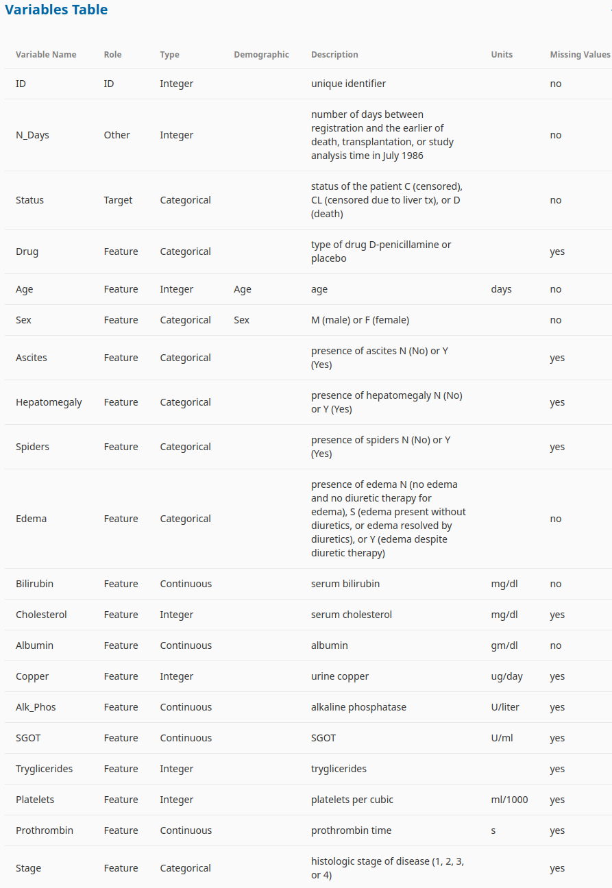

|      | col2                                                                                                     | col3 |
| ---- | -------------------------------------------------------------------------------------------------------- | ---- |
| Name | [Multi-Class Prediction of Cirrhosis Outcomes](https://www.kaggle.com/competitions/playground-series-s3e26) |      |
| Tags | Time Series Analysis Multi-Class                                                                         |      |
| Time | 2023-3                                                                                                   |      |

# Multi-Class Prediction of Cirrhosis Outcomes

数据集描述：


## **1.投票最高的笔记本**

### 1.1 [S3E26 | XGBClassifer](https://www.kaggle.com/code/markuslill/s3e26-xgbclassifer)

* 递归特征消除（RFE）算法可能很有趣，例如使用 sklearn.feature_selection.RFE [sklearn学习——递归特征消除法（RFE）-CSDN博客](https://blog.csdn.net/weixin_42506939/article/details/116669848)
* 语法糖

  ```python
  %%time 
  if GENERATE_REPORTS:
      # Generate the profile report
      profile = ProfileReport(df_train, title="YData Profiling Report - Cirrhosis")
      profile.to_notebook_iframe()
  ```
* 饼图：目标变量是不平衡的。此外，大多数患者都受到审查（意味着患者失去随访或研究在患者死亡或接受肝移植之前结束）。这是生存分析中的常见问题。
* 成对关系图：一些特征可以通过线性方法非常有效地分离（仅检查二维空间）。因此，经典的 SVM 方法可能表现还不错...... 此外，特征分布（直方图）显示了一些漂亮的“钟形”曲线...... [Python可视化 | Seaborn5分钟入门(七)——pairplot - 知乎 (zhihu.com)](https://zhuanlan.zhihu.com/p/98729226)
* 各种编码列表：

| Encoding Technique         | Type of Variable | Support High Cardinality | Handle Unseen Variables | Cons                                         |
| -------------------------- | ---------------- | ------------------------ | ----------------------- | -------------------------------------------- |
| Label Encoding             | Nominal          | Yes                      | No                      | Unseen Variables                             |
| Ordinal Encoding           | Ordinal          | Yes                      | Yes                     | Categories interpreted as numerical values   |
| One-Hot / Dummy Encoding   | Nominal          | No                       | Yes                     | Dummy Variable Trap                          |
| Target Encoding            | Nominal          | Yes                      | Yes                     | Target Leakage Uneven Category Distribution |
| Frequency / Count Encoding | Nominal          | Yes                      | Yes                     | Similar encodings                            |
| Binary Encoding            | Nominal          | Yes                      | Yes                     | Irreversible                                 |
| Hash Encoding              | Nominal          | Yes                      | Yes                     | Information Loss or Collision                |

* 附加功能：

  1. 时间计算：通过日期或时间戳的处理，可以计算出与诊断日期相关的时间测量，这在医疗数据分析中很常见。
  2. 分箱转换：将连续变量（比如年龄）转换为分类变量，有助于简化模型的复杂性，并且可以更好地捕捉变量之间的非线性关系。
  3. 特征组合：通过对不同特征进行组合（比如相乘、相加等），可以创造新的特征，从而更好地捕捉特征之间的交互作用。
  4. 标准化：将原始数据转换为z分数，有助于确保不同变量具有相似的尺度和分布，以便在后续分析中进行比较和组合。
  5. 衍生特征：通过结合不同特征，可以衍生出具有实际意义的新特征，这些特征可能更好地反映了数据的内在规律。

  
* 创建附加特征的Pipline：https://www.kaggle.com/code/markuslill/s3e26-xgbclassifer?scriptVersionId=155390950&cellId=31
* 异常值处理：数字特征看起来“有点”正态分布。因此，特征值与平均值相差超过 6 个标准差的观测值被视为异常值，我们希望将其删除。
* 模型选择：

  
* 

  
* 箱线图观察训练集和验证集上模型的性能：https://www.kaggle.com/code/markuslill/s3e26-xgbclassifer?scriptVersionId=155390950&cellId=52
* CV 后模型（重新）拟合：https://www.kaggle.com/competitions/playground-series-s3e26/discussion/459897#2552033
* 模型集成方法：[stacking](https://machinelearningmastery.com/stacking-ensemble-machine-learning-with-python/)

  
* 看起来（当我们想利用/集成两种方法时），我们应该为每个模型使用不同的特征：https://www.kaggle.com/code/markuslill/s3e26-xgbclassifer?scriptVersionId=155390950&cellId=61

### 1.2 [PS3E26 🔥 | Liver Cirrhosis | EDA | Model ✍](https://www.kaggle.com/code/ashishkumarak/ps3e26-liver-cirrhosis-eda-model)

* 数据预处理：

  * 删除 Drug 列中存在缺失值 (NA) 的所有行
  * 用平均结果估算缺失值
  * 对所有类别属性进行 One-hot 编码
* 

### 1.3[Medical Analysis-Added 21 Features | XGB](https://www.kaggle.com/code/omega11/medical-analysis-added-21-features-xgb)


### 1.4[PS3E26 | Cirrhosis Survial Prediction | Multiclass](https://www.kaggle.com/code/arunklenin/ps3e26-cirrhosis-survial-prediction-multiclass)


### 1.5[PS-S3-Ep26 | EDA 📊 | Modeling + Submission 🚀](https://www.kaggle.com/code/oscarm524/ps-s3-ep26-eda-modeling-submission)


## **2.得分最高的笔记本**

### 2.1[Medical Analysis-Added 21 Features | XGB](https://www.kaggle.com/code/omega11/medical-analysis-added-21-features-xgb)

1. 解决目标类别不平衡（效果不好）：[探索SMOTE算法 - 知乎 (zhihu.com)](https://zhuanlan.zhihu.com/p/275744968)
2. 查看数据特征的正常分布范围：`train_data.describe()`
3. 不同类型的特征采用不同的编码方式，甚至根据特征的具体含义创建独特的编码方式：https://www.kaggle.com/code/omega11/medical-analysis-added-21-features-xgb?scriptVersionId=157737446&cellId=22

   * **`OrdinalEncoder`**：`Drug`、`Sex`、`Ascites`、`Hepatomegaly`、`Spiders`和 `Stage`进行编码
   * **`OneHotEncoder`**：`Edema`
   * `LabelEncoder`：`LABEL`
4. 轻松应用上述逐特征进行代码块：https://www.kaggle.com/code/omega11/medical-analysis-added-21-features-xgb?scriptVersionId=157737446&cellId=24
5. 创建额外特征：

   * **`DiagnosisDateTransformer`** ：计算诊断日期。通过从患者的年龄中减去已知患病天数，估算出患者被诊断出疾病的大致日期。
   * **`AgeYearsTransformer`** ：将年龄转换为年，并对患病天数进行缩放。这有助于模型更好地理解时间相关的特征。
   * **`AgeGroupsTransformer`** ：将年龄分组。基于年龄将患者分为不同的组别，以探索年龄如何影响疾病的发展。
   * **`BilirubinAlbuminTransformer`** ：创建胆红素和白蛋白的交互项。这可能揭示这两个生化指标相互作用对疾病进程的影响。
   * **`DrugEffectivenessTransformer`** ：计算药物效果的特征。这个转换器似乎试图通过药物类型和胆红素水平的乘积来评估药物的效果，但由于 `Drug`是分类变量，直接乘法可能不适用，需要进一步的调整或解释。
   * **`SymptomScoreTransformer`** ：计算症状分数。通过对一系列症状指标进行求和，为每个患者生成一个症状分数。
   * **`SymptomCatTransformer`** ：将症状信息进行独热编码。首先将多个症状指标合并为一个字符串，然后使用独热编码转换，这可以帮助模型更好地理解症状组合的复杂性。
   * **`LiverFunctionTransformer`** ：计算肝功能指数。通过对几个与肝功能相关的指标求平均值，生成一个综合的肝功能指数。
   * **`RiskScoreTransformer`** ：计算风险分数。结合胆红素、白蛋白和碱性磷酸酶（Alk_Phos）来评估患者的健康风险。
   * **`TimeFeaturesTransformer`** ：提取时间特征。将患病天数转换为诊断年份和月份，可能有助于揭示疾病进程随时间的变化。
   * **`ScalingTransformer`** ：对数值型特征进行标准化处理。这是机器学习中常见的预处理步骤，有助于模型更好地学习和收敛。
6. 异常值检测：特征值与平均值相差超过 6 个标准差的观测值被视为异常值，我们希望将其删除。
7. 计算偏差特征并创建“_is_normal”特征：最初的饼图说明了正常范围内和之外的患者分布，**但没有指定是低于还是高于**！重要的是要认识到，从医学角度来看，并非所有特征在正常范围之外都会带来风险。例如，白蛋白低于正常范围时存在风险，而胆红素高于正常范围时存在风险。因此，对所有特征采用二元方法（正常范围内/正常范围外）可能并不合适。相反，我们应该将它们分类为上面（对于大多数功能）、下面（对于白蛋白）或两者（对于血小板）。
8. 偏差列的最终形状：负偏差（原本低于正常范围的值）/ 正偏差（原本高于正常范围的值）/ 零偏差（原本在正常范围内的值）。
9. 特殊模式：某些特征在低于正常范围时会带来更大的风险，而在高于正常范围时则相反。白蛋白的独特模式 - 每个去世的人的白蛋白水平都低于正常范围。相比之下，对于大多数其他特征，读数主要高于正常范围。
10. 从论文中发掘新特征：白蛋白-胆红素的新功能，该论文强调了用作肝脏相关死亡率预测因子的各种相关特征，包括梅奥评分。关于 ALBI，研究论文指出，根据 ALBI 值将患者分为三组，如下图所示。因此，我将在分析中包括ALBI_status。

    
11. PCA：我从总共 72 个特征中选择了大约 30 个进行训练。MLmosaic 提出了一种有效策略，将剩余特征用于主成分分析 (PCA)。经过多次试验，我确定了 PCA 整合的最佳特征以及为训练目的而保留的特征。Mayo 风险评分和 ALBI 被放入 PCA，而 **ALBI_status 被保留用于直接训练目的；**解释的方差比**：这表示第一主成分保留了原始数据多少百分比的方差（或信息）。这个指标有助于评估降维的效果。**
12. 平均投票分类器 `MyAvgVoting`：https://www.kaggle.com/code/omega11/medical-analysis-added-21-features-xgb?scriptVersionId=157737446&cellId=75
13. 结合其他方案结果的代码段：https://www.kaggle.com/code/omega11/medical-analysis-added-21-features-xgb?scriptVersionId=157737446&cellId=83

## **3.高分方法与讨论**
