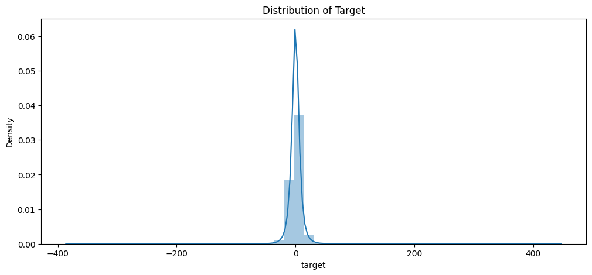
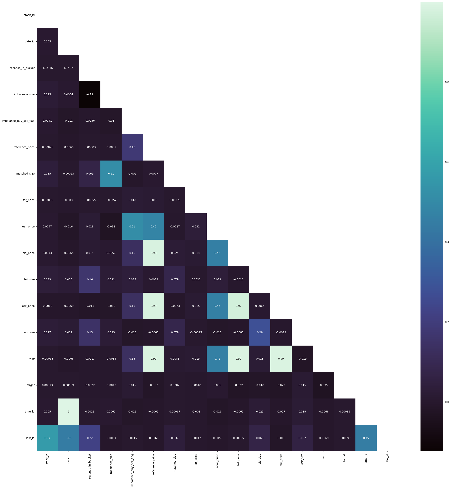
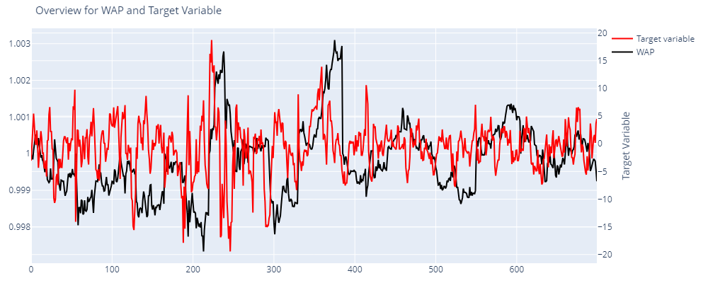

| Name | [Optiver - Trading at the Close](https://www.kaggle.com/competitions/optiver-trading-at-the-close/overview) |
| ---- | -------------------------------------------------------------------------------------------------------- |
| Tags | Tabular Finance                                                                                          |
| Time |                                                                                                          |

# Optiver - Trading at the Close

## 数据

[train/test].csv 拍卖数据。测试数据将通过API传递。

* `stock_id` - 股票的唯一标识符。并非所有股票 ID 都存在于每个时间桶中。
* `date_id` - 日期的唯一标识符。所有股票的日期 ID 都是连续且一致的。
* `imbalance_size` - 当前参考价格（美元）不匹配的金额。
* `imbalance_buy_sell_flag` - 反映拍卖不平衡方向的指标。
  *  买方失衡； 1
  *  卖方失衡； -1
  *  无不平衡； 0
* `reference_price` - 配对股票的价格按顺序最大化、不平衡最小化以及与买卖中点的距离最小化。也可以被认为等于最佳买价和卖价之间的近期价格。
* `matched_size` - 以当前参考价格（美元）可匹配的金额。
* `far_price` - 仅根据拍卖兴趣最大化匹配股票数量的交叉价格。此计算不包括连续市价订单。
* `near_price `- 交叉价格将最大化基于拍卖和连续市价订单的匹配股票数量。
* `[bid/ask]_price` - 非拍卖簿中最具竞争力的买入/卖出水平的价格。
* `[bid/ask]_size` - 非拍卖簿中最具竞争力的买入/卖出水平的美元名义金额。
* `wap` - 非拍卖簿中的加权平均价格。
  
* `seconds_in_bucket` - 自当天收盘竞价开始以来经过的秒数，始终从 0 开始。
* `target` - 股票波动率的 60 秒未来走势，减去综合指数的 60 秒未来走势。仅适用于train文件。
  * `综合指数`是Optiver为本次大赛构建的纳斯达克上市股票定制加权指数。
  * 目标的单位是`基点`，是金融市场的常用计量单位。 1 个基点的价格变动相当于 0.01% 的价格变动。
  * 其中 `t `是当前观察的时间，我们可以定义目标：
    

**所有与尺寸相关的列均以美元计算。**

**所有与价格相关的列都会在拍卖期开始时转换为相对于股票 wap（加权平均价格）的价格变动。**

`Reveal_targets` 当每个日期的第一个 time_id 时（即当 seconds_in_bucket 等于 0 时），API 将提供一个数据帧，提供整个前一个日期的真实 target 值。所有其他行都包含感兴趣的列的空值。

`public_timeseries_testing_util.py` 一个可选文件，旨在使运行自定义离线 API 测试变得更容易。

`example_test_files/` 用于说明 API 如何运行的数据。包括 API 提供的相同文件和列。前三个日期 ID 是训练集中最后三个日期 ID 的重复，以说明 API 的功能。

`optiver2023/ `启用 API 的文件。预计 API 将在五分钟内交付所有行并保留少于 0.5 GB 的内存。 API 提供的前三个日期 ID 是训练集中最后三个日期 ID 的重复，以更好地说明 API 的功能。您必须对这些日期进行预测才能推进 API，但这些预测不会评分。

# 1.EDA

## 1.1[Optiver 2023 | EDA | PyTorch: LSTM-Attention Model](https://www.kaggle.com/code/aniketkolte04/optiver-2023-eda-pytorch-lstm-attention-model)

1. 数据信息

   
2. 目标分布：

   
3. 特征相关性热力图

   
4. 第0号股票

   
5. 对第0号股票展示询问价格和竞价走势图

   
6. WAP和目标值的走势图

   
7. 模型：LSTMwithAttention🤩:https://www.kaggle.com/code/aniketkolte04/optiver-2023-eda-pytorch-lstm-attention-model?scriptVersionId=150748092&cellId=25
8. 早停器：EarlyStopper🤩:https://www.kaggle.com/code/aniketkolte04/optiver-2023-eda-pytorch-lstm-attention-model?scriptVersionId=150748092&cellId=30

## 1.2[📈Optiver - Trading at the Close - R EDA](https://www.kaggle.com/code/docxian/optiver-trading-at-the-close-r-eda)

# 2.投票最高的笔记本

# 3.得分最高的内核

# 4.最高方法和讨论
